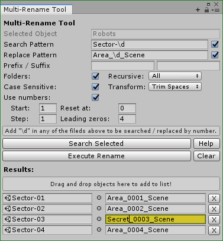
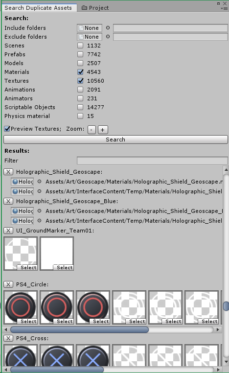
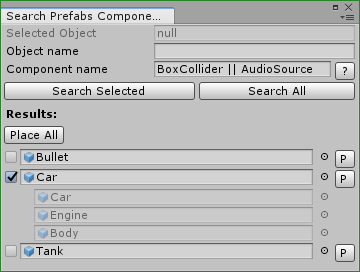
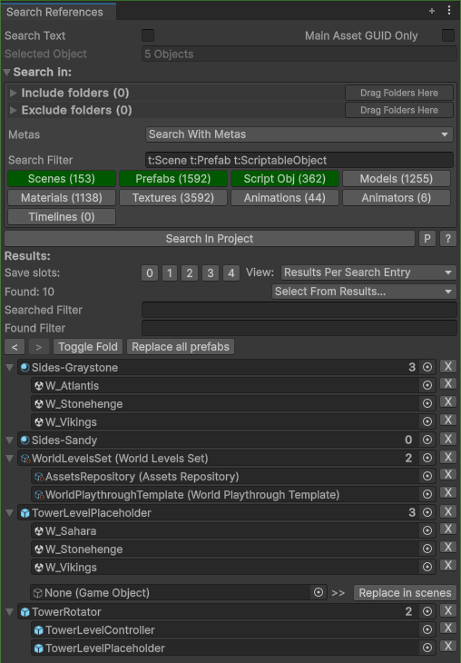
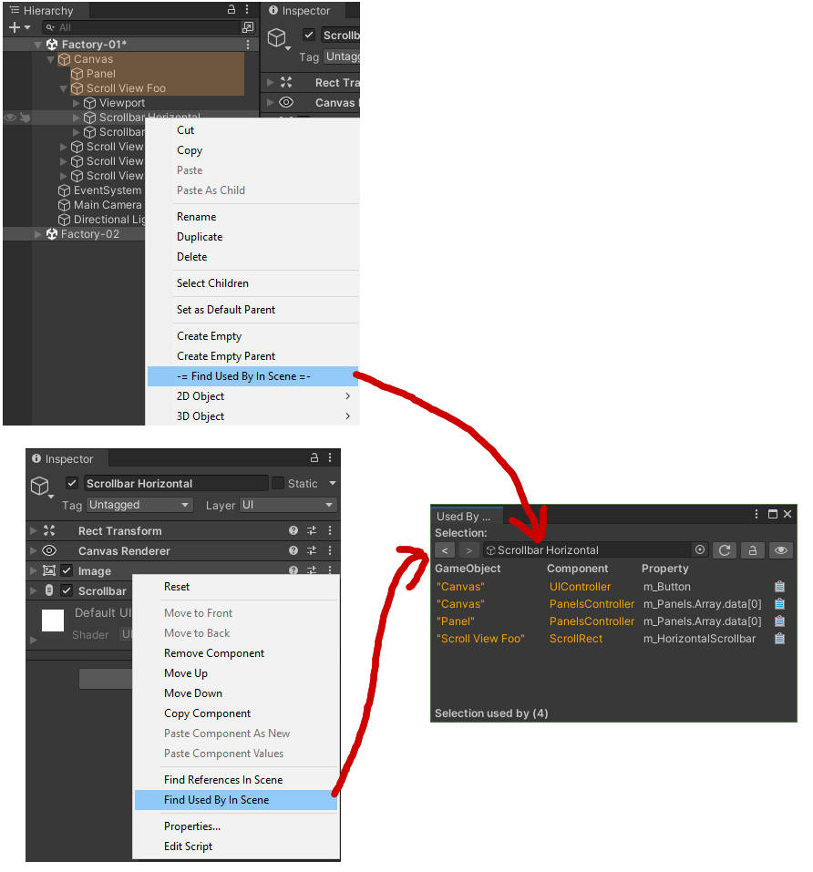

# Asset Management Tools for Unity
Small collection of tools for Unity used to manage your assets. Part of the [DevLocker](https://github.com/NibbleByte/DevLocker) project.

[Asset Store - MultiRename Tool](https://assetstore.unity.com/packages/tools/utilities/multi-rename-tool-170616) | [Asset Store - Scenes In Project](https://assetstore.unity.com/packages/tools/utilities/scenes-in-project-169933) | [OpenUPM](https://openupm.com/packages/devlocker.tools.assetmanagement/)

[](https://openupm.com/packages/devlocker.tools.assetmanagement/)

## List of Tools
* [Scenes In Project](#scenes-in-project) *(the star of this project)*
* [MultiRename Tool](#multirename-tool)
* [Search Duplicate Assets](#search-duplicate-assets)
* [Search References Fast!](#search-references-fast) *(discontinued)*
* [Search Prefabs Components](#search-prefabs-components)

## Installation
* Asset Store plugin: 
  * [Scenes In Project](https://assetstore.unity.com/packages/tools/utilities/scenes-in-project-169933)
  * [MultiRename Tool](https://assetstore.unity.com/packages/tools/utilities/multi-rename-tool-170616)
* [OpenUPM](https://openupm.com/packages/devlocker.tools.assetmanagement/) support:
```
npm install -g openupm-cli
openupm add devlocker.tools.assetmanagement
```
* Github upm package - merge this to your `Packages/manifest.json`
```
{
  "dependencies": {
    "devlocker.tools.assetmanagement": "https://github.com/NibbleByte/UnityAssetManagementTools.git#upm"
}
```

## Usage
All these tools can be found in the menus: "Tools/Asset Management/..."

## Scenes In Project

List of all available scenes in the project for quick access.<br />
Useful when you have to switch often between scenes in larger projects.

### Features:
* **List all scenes in project. Pin favourites at the top.**
* **"►" button per scene to run in play mode directly.**
* **"+" button per scene to add / remove additively.**
* Sort scenes by name, path, date, file size, or just drag them around.
* Scenes are grouped by folder. Groups are separated by little space.
* Customize how scenes are displayed.
* Color-code scenes by path or name.
* Multiple windows support (they all show the same though).
* Tested on a project with 1k+ scenes.
* Personal VS Project preferences. 
  * Personal preferences stored locally in the Library folder.
  * Project preferences to be shared with your team stored in the ProjectSettings folder.

## MultiRename Tool

Mass search and rename assets or scene game objects.

### Features:
* Live referesh on results when changing the initial parameters.
* Search pattern can contain "\d" to match any numbers.
* Replace pattern can contain "\d" to insert number (counter).
  * Can configure numbers start and step value + leading zeroes.
* Can tweak the final name before executing the rename.
* Can search recursively in folders, subassets or scene objects hierarchies.
* Disable Search or Replace pattern to match / replace everything.
<br />
<br />
<br />
<br />

## Search Duplicate Assets
Searches the project for duplicate assets (compares files by name only).

### Features:
* Displays duplicates in a grouped list.
* Textures are displayed as images in a single row for easy comparison.
* Can specify what asset types to search for.



## Search Prefabs Components

Search selected or all prefabs in the project if they have the specified components attached.

### Features:
* Type in component names to search for. Works with user and built-in components.
* Supports '&', '|', '!' *(and, or, not)* expressions for more complex queries.
* Results list displays what GameObjects in the prefab have these components.
* Can place all or individual result prefabs in the scene for quick inspection / tweaking. Can quickly remove them when done.

## Search References Fast!
Search what assets in the project refer directly to the selected ones.<br />
It gets the target GUIDs and performs text search in all project assets without actually loading them. <br />
This is very fast for searching prefabs references in scenes as it wouldn't load the scenes themselves. <br />

**NOTE: This tool requires your project to have "Assets Serialization Mode" set to "Force Text" in the project settings.**

**Discontinued: there are much better tools out there that offer better features, UX and support. This tool was uploaded here for historical reasons.**

### Features:
* Can search for sub assets (GUID + localId)
* Can search text directly (instead of selected asset GUIDs).
* Select what types of assets to search in. Can include / exclude meta files as well.
* Replace prefab instances in found scenes with another or just remove them.
* Select the assets in the result by type.
* Doesn't load assets (especially scenes which is slow).

### Issues & Drawbacks:
* Project needs to have "Assets Serialization Mode" set to "Force Text"
* Doesn't work with nested prefabs.
* No cache. Every search is done from scratch.
* No recursive mode - search direct references only.
* If result has multiple sub assets, it wouldn't show you which one references the target.

### Example:
In the screenshot below:
* "Bullet" prefab is referenced by the "TankShoot" animation.
* The "Car" prefab is referenced by 3 scenes.
* The "Tank" prefab is referenced by another 3 scenes.
* "Car" and "Tank" prefab can be replaced or removed in the found scenes with another using the last field.


## Find References In Scene
Search references to specified GameObject or component in the current scene (or prefab edit stage).
Open by right click on GameObject and selecting "Find References In Scene". You can additionally drag in any component as well.
